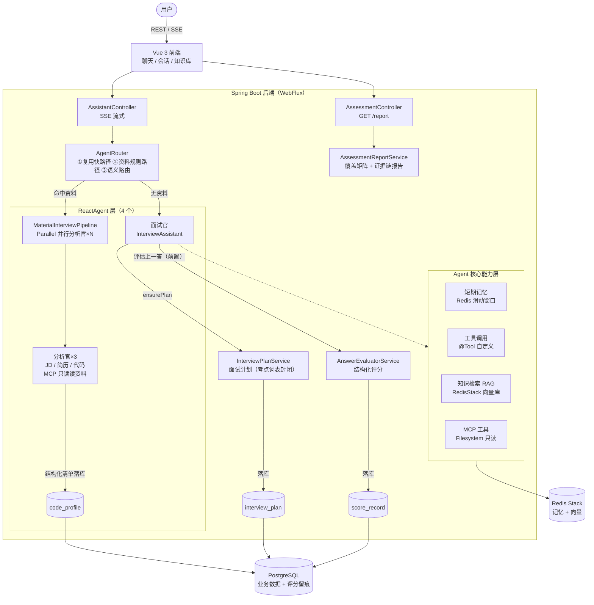
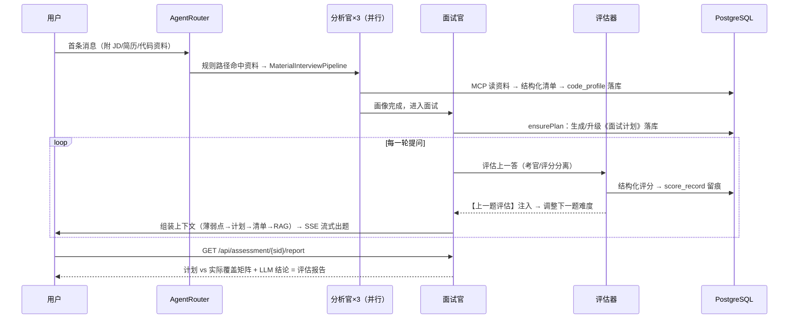

# AI Interviewer（AI 多 Agent 模拟面试官）

基于 **Spring AI Alibaba 1.1** 从 0 到 1 构建的多 Agent 能力评估系统：输入 JD / 简历 / 代码，多 Agent 并行画像，按《面试计划》实时自适应考核，输出**带证据链的《面试评估报告》**。

> 产品立场：不是聊天陪练，是**可验证的能力评估**。报告可信在结构上要求五件事：范围契约（面试计划）、考官与评分分离、考点词表封闭、证据可溯（逐题留痕）、跨场次采样聚合。另一条全局设计判据：**LLM 调用 ≠ Agent**——只有需要工具循环/临场决策的环节才用 ReactAgent（面试官 + 3 个分析官），规划/评估/报告都是"带 LLM 的普通函数"。

## ✨ 核心功能

- ** AI 模拟面试**：ReactAgent 面试官按《面试计划》逐轮出题、追问、点评，SSE 流式输出
- ** 多资料画像**：JD 分析官 / 简历分析官 / 代码分析官并行运行（MCP 只读读取本地资料），产出结构化清单落库，作为出题依据
- ** 智能意图路由**：三道关口——复用快路径 → 资料规则路径 → 语义路由（LLM 二分类），省 token 且不误路由
- ** 面试计划（范围契约）**：JD 考察矩阵 → 考点计划落库，每轮注入面试官；USER 临时计划在 JD 画像落库后自动升级
- **️ 会话内评估闭环**：答案评估器（考官/评分分离）对每轮回答结构化评分，代码侧落库留痕，评估结果当场注入影响下一题难度
- ** 带证据链的评估报告**：计划 vs 实际覆盖矩阵由 Java 计算数字（零幻觉），LLM 只写结论，独立端点获取
- ** 题库 RAG**：Redis Stack 向量库 + 文本 Embedding，面试官出题前检索知识库文档增强上下文
- ** 跨会话薄弱点回顾**：候选人维度 SQL 聚合历史评分（精度高、零幻觉），开场注入或工具主动获取
- **️ MCP 工具生态**：MCP Client 接入官方 Filesystem Server（只读过滤），支持"代码评审式面试"
- ** 会话与知识库管理**：多会话管理、历史回看/载入/清空；知识库文档同步、分块、幂等入库

## 🏗️ 系统架构



## 🔄 核心流程（一次资料面试会话）



## 🛠️ 技术栈

### 后端

| 层 | 选型 |
|---|---|
| 框架 | Spring Boot 3.5.7（WebFlux / Netty，SSE 流式） |
| AI 框架 | Spring AI 1.1.2 + Spring AI Alibaba 1.1.2.0 |
| 模型接入 | 阿里百炼（DashScope OpenAI 兼容协议）：qwen3.7-flash / qwen3.7-text-embedding |
| 短期记忆 / 向量检索 | Redis Stack（滑动窗口记忆 + 向量库） |
| 业务持久化 | PostgreSQL 16 + Spring Data JPA |
| MCP | MCP Client 接入官方 Filesystem Server（ReadOnlyMcpToolFilter 只读） |
| Agent 模式 | ReactAgent（面试官 + 分析官×3）、ParallelAgent 并行画像、LlmRoutingAgent 意图路由 |

### 前端

| 维度 | 选型 | 说明 |
|---|---|---|
| 框架 | Vue 3（`<script setup>`） | 响应式天然契合 SSE 流式聊天 |
| 构建 | Vite | 开发态 proxy `/api` → 8080，免 CORS |
| 语言 | TypeScript | 接口契约与后端一一对应 |
| 状态管理 | Pinia | 按域拆分（chat / sessions / knowledge） |
| 路由 | Vue Router（hash 模式） | 聊天 / 会话 / 知识库三页面 |
| 流式解析 | 自写 SSE 解析器（fetch + ReadableStream） | POST 流式，支持打字机效果 |
| 样式 | 自写轻量 CSS（CSS 变量） | 不引重型 UI 库，可控干净 |

## 📁 项目结构

```
├── src/main/java/com/xiao/aiagent/
│   ├── controller/        # Assistant（SSE 对话）/ Assessment（报告）/ Memory / KnowledgeBase
│   ├── services/          # AgentRouter 路由、流水线、面试官、3 个分析官、
│   │                      # 面试计划 / 答案评估 / 评估报告 / RAG 检索 / 薄弱点聚合
│   ├── config/            # Agent 装配、模型适配、知识库加载
│   ├── entity/            # CodeProfile / InterviewPlan / ScoreRecord / KnowledgeDocument
│   └── repository/        # Spring Data JPA
├── frontend/              # Vue 3 独立工程（Vite + TS + Pinia）
│   └── src/{api,stores,views,components,utils}
├── docs/                  # 前后端架构文档 + 分阶段开发计划（详细设计都在这里）
└── docker-compose.yml     # PostgreSQL / Redis Stack 本地依赖
```

## 🚀 快速开始

### 1. 启动依赖（PostgreSQL + Redis Stack）

```bash
docker compose up -d
```

### 2. 配置密钥

应用通过 **local profile** 加载本地私密配置（`application-local.properties`，已在 `.gitignore` 中，不会入库）。克隆后自己建一份：

```properties
# src/main/resources/application-local.properties
spring.ai.openai.api-key=sk-你的DashScope-Key
```

或者用环境变量（优先级更高，可覆盖配置文件）：

```bash
# Windows PowerShell
$env:DASHSCOPE_API_KEY="sk-xxx"
# Linux / macOS
export DASHSCOPE_API_KEY=sk-xxx
```

> API Key 获取：[阿里云百炼控制台](https://bailian.console.aliyun.com/)。项目必须走 OpenAI 兼容端点（`compatible-mode`），配置中已固定。

### 3. 启动后端

```bash
mvn spring-boot:run           # 默认端口 8080（需本机已装 Maven）
```

### 4. 启动前端

```bash
cd frontend
npm install
npm run dev                   # http://localhost:5173，/api 已代理到 8080
```

### 5. 生产态部署（可选）

```bash
cd frontend && npm run build
# 将 dist/* 拷贝到 src/main/resources/static/，由 Spring Boot 同源托管
# 访问 http://localhost:8080/ 即前端，/api/* 同源无跨域
```

## 🔐 安全说明

- 仓库内不含任何真实密钥：`application.properties` 只留 `${DASHSCOPE_API_KEY:}` 占位符，真实 Key 放在 gitignore 的 `application-local.properties` 或环境变量中
- `data/`（外部知识库）、`test-http/`、`.verify-payloads/` 等本地调试产物均不入库
- git 历史经过 filter-branch 清洗，不含历史遗留密钥
